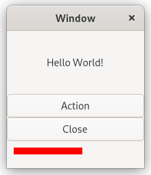

# ts-for-gjs

[TypeScript](https://www.typescriptlang.org/) binding generator for
[GJS](https://wiki.gnome.org/Projects/Gjs) and
[node-gtk](https://github.com/romgrk/node-gtk).  Inspired by
[gir2dts](https://github.com/darkoverlordofdata/gir2dts) but re-written and
re-designed to be a more thorough TypeScript description of the [GObject
introspection](https://wiki.gnome.org/Projects/GObjectIntrospection)
interfaces.

The definitions can be used for both TypeScript or JavaScript projects.

## Install

```bash
git clone https://github.com/sammydre/ts-for-gjs
cd ts-for-gjs
git submodule update --init
yarn install
yarn run build
yarn link
```

### yarn

WARNING: Do not use [the yarn package](https://www.yarnjs.com/package/ts-for-gir), this has not been published by us, is heavily outdated and every attempt to contact the person who published this package on yarn was unsuccessful.

We will publish this project ourselves under a different name on yarn in the near future.

### CLI

To generate the Typescript type definitions of Gtk-4.0 for Gjs run

```
ts-for-gir generate Gtk-4.0 -e gjs
```

To generate this types for node-gtk run 

```
ts-for-gir generate Gtk-4.0 -e node
```
You can also look [at the examples](/examples/) to see how the types are generated there and at the [CLI Package](/packages/cli) for the full CLI documentation.

## Examples

Go to the examples directory and run `yarn run start`, this will build the types and the example and then run it.
You can also use the configurations of the examples as a template.

Now open some code with an editor that understands TypeScript and see what happens, for example
[Visual Studio Code](https://code.visualstudio.com/).

```bash
code examples/gjs/browser
```
### Gtk-3.0 Browser


This example uses ESM when building the types and executing Gjs.
On Node.js ESM is converted back to CommonJS (as long as node-gtk doesn't support ESM), but this way the types can still be used in ESM format.

See also [About the `--moduleType esm` option](#about-the---moduletype-esm-option).

Source: [Gjs](/examples/Gjs/gtk-3-browser), [node-gtk](/examples/node-gtk/gtk-3-browser)  
Builder: Webpack  
Module: ESM  

Build and run:
```bash
cd /examples/Gjs/gtk-3-browser
yarn run start

# or for node-gtk
cd /examples/node-gtk/gtk-3-browser
yarn run start
```

### Gtk-3.0 Builder


Source: [Gjs](/examples/Gjs/gtk-3-builder), [node-gtk](/examples/node-gtk/gtk-3-builder)  
Builder: Webpack  
Module: CommonJS    

Build and run:
```bash
cd /examples/Gjs/gtk-3-builder
yarn run start

# or for node-gtk
cd /examples/node-gtk/gtk-3-builder
yarn run start
```

### Gtk-3.0 Editor


Source: [Gjs](/examples/Gjs/gtk-3-editor), [node-gtk](/examples/node-gtk/gtk-3-editor)  
Builder: Webpack  
Module: CommonJS    

Build and run:
```bash
cd /examples/Gjs/gtk-3-editor
yarn run start

# or for node-gtk
cd /examples/node-gtk/gtk-3-editor
yarn run start
```

### Gtk-3.0 Hello Gtk


Source: [Gjs](/examples/Gjs/gtk-3-hello), [node-gtk](/examples/node-gtk/gtk-3-hello)  
Builder: Webpack  
Module: CommonJS    

Build and run:
```bash
cd /examples/Gjs/gtk-3-hello
yarn run start

# or for node-gtk
cd /examples/node-gtk/gtk-3-hello
yarn run start
```

### Gtk-4.0 ListStore


GJS example showing how to build Gtk4 applications using `Gtk.TreeView` and `Gtk.ListStore`

Source: [Gjs](/examples/Gjs/gtk-4-list-store)  
Builder: ESBuild  
Module: ESM  

Build and run:
```bash
cd /examples/Gjs/gtk-4-list-store
yarn run start
```

### HTTP Server + Client

```
> gjs -m dist/http-server.js
Visit http://localhost:1080
```

```
> gjs -m dist/http-client.js
Gjs-Message: 21:13:22.007: JS LOG: status: 200 - OK
Gjs-Message: 21:13:22.007: JS LOG: Date: Wed, 06 Apr 2022 19:13:22 GMT
Gjs-Message: 21:13:22.007: JS LOG: Content-Type: text/html; charset=utf-8
Gjs-Message: 21:13:22.007: JS LOG: Content-Length: 135
Gjs-Message: 21:13:22.008: JS LOG: body:

        <html>
        <body>
            Hello, gjs! ☺<br>
            <a href="/">Go back</a>
        </body>
        </html>
```


GJS example showing how to build a http server/client using Soap 3.  
This example contains a client and a server example, for the client example the server must be running. You can also start the server from the node-gtk example and then request that with the gjs example and vice versa ;)

Source: [Gjs](/examples/Gjs/soup-3-http), [node-gtk](/examples/node-gtk/soup-3-http)  
Builder: ESBuild  
Module: ESM  

Build and run:
```bash
cd /examples/Gjs/soup-3-http
yarn run build
yarn run start:server
yarn run start:client

# or for node-gtk
cd /examples/node-gtk/soup-3-http
yarn run build
yarn run start:server
yarn run start:client
```

### Gtk4 Custom Widget


This example shows the usage of custom widgets and virtual functions in Gjs and node-gtk.

Source: [Gjs](/examples/Gjs/gtk-4-custom-widget), [node-gtk](/examples/node-gtk/gtk-4-custom-widget)  
Builder: ESBuild  
Module: ESM    

Build and run:
```bash
cd /examples/Gjs/gtk-4-custom-widget
yarn run start

# or for node-gtk
cd /examples/node-gtk/gtk-4-custom-widget
yarn run start
```

## What it's like


## Development

Install GObject Introspection Repository files:

```bash
# Ubuntu 22.04
sudo apt update && sudo apt install \
    libappindicator3-dev \
    libgda-5.0-dev \
    libgirepository1.0-dev \
    libgtk-3-dev \
    libgtk-4-dev \
    libgtksourceview-3.0-dev \
    libnotify-dev \
    libsoup2.4-dev \
    libsoup-3.0-dev \
    libwebkit2gtk-4.0-dev

# Fedora 35
sudo dnf update && sudo dnf install \
    libappindicator-gtk3-devel \
    libgda-devel \
    gobject-introspection-devel \
    gtk3-devel \
    gtk4-devel \
    libsoup3-devel \
    gtksourceview3-devel \
    libnotify-devel \
    libsoup-devel \
    webkit2gtk3-devel
```

Generate example type definitions:

```bash
yarn run regress
```
### Gir XML Format

See [gobject-introspection/docs/gir-1.2.rnc](https://gitlab.gnome.org/GNOME/gobject-introspection/-/blob/master/docs/gir-1.2.rnc) for type definitions.

### Debugging

It is strongly recommended to use the debugger. For Visual Studio Code there are some predefined launch configurations for it. Take a look at the following video:

https://user-images.githubusercontent.com/1073989/150143112-1c0a2dab-3d4c-4472-818f-8404a620cc53.mp4

### yarn Scripts

#### Validate

To validate all your generated type definition files in this project run 

```bash
yarn run validate:types:all
```

To validate only your type definition files for Gjs

```bash
yarn run validate:types:gjs
```

To validate only your type definition files for node-gtk

```bash
yarn run validate:types:node
```

You can also validate a single type definition file like this

```bash
yarn run validate -- ./@types/Gjs/GObject-2.0.d.ts
```


### Test

#### Ava

To run our [ava](https://github.com/avajs/ava) tests just run:

```bash
yarn run test:ava
```

#### Test gir files

We have a test which tries to generate the type definition files for all gir files from the [vala-girs](https://github.com/nemequ/vala-girs) repository.

Before you can run this test you need to checkout the vala-girs submodule, to do that run this in the root of ts-for-gjs:

```bash
git submodule update --init
```

Now you can run the test with

```bash
yarn run test:girs:gjs
yarn run test:girs:node
# or yarn run test:girs:all
```

## FAQ

Problem: I get the following error:

```
FATAL ERROR: Scavenger: semi-space copy Allocation failed - JavaScript heap out of memory
```

Solution:

```bash
sudo sysctl -w vm.max_map_count=262144
NODE_OPTIONS=--max-old-space-size=25600 yarn run ...
```


## Related Projects

### TypeScript Type Definitions

* [gnome-gtk](https://github.com/codejamninja/gnome-gtk) - Typescript bindings for gnome gtk
* [ts-gir](https://github.com/codejamninja/ts-gir) - Typescript bindings for GJS
* [node-gir-typedef](https://github.com/SolarLiner/node-gir-typedef) - TypeScript bindings for node-gir
* [gir2dts](https://github.com/darkoverlordofdata/gir2dts) - The project this is inspired by
* [gir-dts-generator](https://github.com/Place1/gir-dts-generator) - The project that inspired this project
* [gjs-ts](https://github.com/niagr/gjs-ts) - Typescript bindings for GJS
* [Typescript Doclet](https://github.com/gjsify/doclet) - Experimental TypeScript binding generator written in Vala as a Valadoc extension
* [gi.ts](https://gitlab.gnome.org/ewlsh/gi.ts) - Highly accurate TypeScript bindings for GJS
* [gi-ts](https://github.com/gi-ts) TypeScript Type definitions for the GNOME base stack (e.g. GLib, GObject) 

### Other

* [gjs-docs](https://github.com/apla/gjs-docs) - GJS documentation server written using gjs
* [node-gtk](https://github.com/romgrk/node-gtk) - GIO bindings for NodeJS
* [cgjs](https://github.com/cgjs/cgjs) - A NodeJS / CommonJS Runtime for GJS
* [jsgtk](https://github.com/WebReflection/jsgtk) - Replaced by cgjs
* [vala-girs](https://github.com/nemequ/vala-girs) - Collection of GIRs and VAPIs for the Vala toolchain
* [gjs-examples](https://github.com/optimisme/gjs-examples) - GJS examples showing how to build Gtk javascript applications
* [hello-gjs-yarn](https://github.com/jo/hello-gjs-yarn) - Gjs example using Babel and Rollup
* [vala-object](https://github.com/antono/vala-object) - Set of examples of how you can build native code with Vala and use it in Gjs, Node.js and other environments
